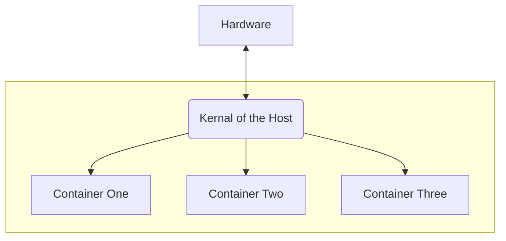

# Docker Example

Learning and leaveraging docker for fun.

## Getting started
I primarily work on OSx or various linux distrobutions so all steps here are assuming you are on OSx and are comfortable with a shell.

1. Go to https://www.docker.com/ and select the download and intsall button, select your operating system and hardware requirements. Alternatively use their guide here https://docs.docker.com/desktop/
1. Once installed 

## Under the hood basics

Docker runs 2 main processes on your machine, the `Docker` Client application and the `Dockerd` Daemon application. These communicate to eachother via REST APIs. Most users will user interactions will be through the Docker client application or CLI.

## Images

Basic images can be found at https://hub.docker.com/

Locally for a test run we can run `docker run hello-world` and this will clone and run the most basic image of everyone's favorite program, the hello world tutorial.

These containers can package much more than software and configuration. They can package entire runtime environments with application code, dependencies, libraries, binaries, and all necessary configuration files. 

## Scoping and Isolation

Namespaces:
Give each container its own view of system resources such as processid, network interfacess, and file systems.

cgroups:
Limit and monitor resources that each contrainer can use (cpu, memory, disk I/O).

## Operating System/Contrainer Virtualization

